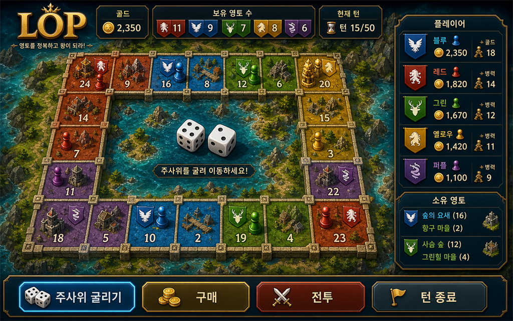

# LOP 기획서

최신화: 2026-05-29

---

## 플레이 미리보기

### 플레이 미리보기

---
## 게임 개요

LOP는 짧은 플레이타임을 목표로 한 영토 쟁탈 보드게임이다. 플레이어는 주사위를 굴려 말을 이동하고, 중립 영토를 점령하거나 상대 영토와 전투하며, 건물을 통해 통행료와 회차 생산을 강화한다.

## 핵심 목표

- 상대 골드를 압박해 경제적으로 무너뜨린다.
- 영토를 점령하고 병력 생산 기반을 넓힌다.
- 건물과 병력 구성을 활용해 위험 타일을 돌파한다.

## 최신 UX 방향

2026-05-14 변경 방향은 A+C 레이아웃이다.

- A: 보드를 화면의 중심에 크게 유지한다.
- C: 현재 해야 할 행동만 하단 액션 바에서 단계별로 안내한다.

## 플레이 화면 구조

1. 상단 HUD
   - 플레이어별 골드, 영토 수, 병력 합계, 활성 효과 수를 압축 표시한다.
   - 현재 턴 플레이어만 강하게 강조한다.

2. 중앙 보드
   - 5x4 보드를 가장 큰 의사결정 영역으로 유지한다.
   - 이동 선택, 강제 매각, 드래곤 상태 같은 즉시성 높은 정보만 보드 위에 짧게 표시한다.

3. 우측 타일 상세 패널
   - 선택한 타일의 소유자, 구매가/통행료, 병력, 건물, 회차 생산 정보를 고정 표시한다.
   - 플레이어가 팝업을 놓쳐도 현재 타일 정보를 계속 확인할 수 있게 한다.

4. 하단 액션 바
   - 현재 phase를 사람이 이해하기 쉬운 단계로 번역한다.
   - 예: 주사위 굴리기, 말 선택, 타일 행동, 전투 해결, 통행료 정산.
   - 복잡한 선택은 기존 모달을 유지하되, 다음 행동의 이유와 맥락을 하단에서 안내한다.

## 시작/온보딩 화면

시작 화면은 세 단계로 구성한다.

1. 게임 목표
   - 승리 조건과 턴 루프를 짧게 설명한다.

2. 게임 설정
   - 참가 인원과 난이도를 선택한다.
   - 각 선택지는 짧은 설명을 함께 제공한다.

3. 캐릭터 공개
   - 캐릭터는 랜덤으로 결정된다.
   - 공개 화면에서 캐릭터 역할과 첫 턴 전략 힌트를 제공한다.

## 기획적 개선점

- 초보자는 “현재 무엇을 해야 하는지”를 하단 액션 바에서 즉시 알 수 있어야 한다.
- 숙련자는 보드를 보면서 우측 패널로 타일 수익과 위험도를 빠르게 비교할 수 있어야 한다.
- 정보는 항상 같은 위치에 머물러야 한다. 일시적인 중앙 오버레이는 전투, 이벤트, 상점처럼 선택지가 많은 순간에만 사용한다.
- 한 화면에서 모든 세부 정보를 보여주기보다, 보드-패널-액션 바의 역할을 분리해 반복 플레이 피로를 줄인다.

## 구현 상태

- 상단 HUD 압축 적용.
- 보드 중심 레이아웃과 우측 타일 상세 패널 적용.
- 하단 phase 안내 액션 바 적용.
- 시작 화면을 목표, 설정, 캐릭터 공개 흐름으로 재구성.
- 땅 구매 후에도 추가 병력을 배치할 수 있도록 개선.
- 배치 모달에 현재 주둔, 추가 배치, 배치 후 주둔, 말에 남는 병력을 표시.

- 플레이어 말이 이동 경로에서 내 영토를 지나칠 때는 이동을 확정하기 전에 정차 여부를 먼저 묻는다. 정차를 선택하면 해당 영토로 이동하고, 계속 이동을 선택하면 원래 주사위 목적지까지 이동한다.

- 내 영토 방문 시 골드를 지불해 즉시 병력을 생산하는 경로를 제거했다. 병력 보강은 랩 생산, 배치, 징집, 상점, 용병, 카드로 제한한다.
- 착지한 타일에 적 말이 있으면 전투를 강제한다. 단, 그 적 말이 자기 주인의 영토 위에 있을 때는 기존처럼 통행세를 내고 지나가거나 전투를 선택할 수 있다.

- 패배한 말은 소유 영토 중 하나로 후퇴한다. 소유 영토가 하나도 없으면 현재 위치에 남으며, 방어자가 잃은 전투 타일은 후퇴 후보에서 제외한다.

## 2026-05-20 UX 폴리싱 추가

- 영토 행동 모달에 전투 예상 정보를 추가했다. 공격 병력과 수비 병력을 비교해 `우세`, `접전`, `위험`, `무혈 점령`으로 표시하고, 전투 버튼에도 같은 판단을 노출한다.
- 적 영토에서는 통행세와 보유 골드를 함께 보여주며 납부 후 잔액 기준으로 `여유`, `주의`, `부족` 상태를 미리 안내한다.
- 중립 영토 구매 시 구매 후 병력 배치 단계로 이어진다는 설명을 행동 전에 보여준다.
- 보드 중앙의 빈 공간에 현재 턴 요약 패널을 추가했다. 현재 단계, 플레이어, 주사위, 선택 말 병력, 보유 골드, 최근 로그를 한눈에 확인할 수 있다.
- 말 선택, 이동지 선택, 강제 매각처럼 사용자가 대상을 골라야 하는 단계에서는 선택 가능한 타일을 청록색 링으로 강조하고 나머지는 흐리게 처리한다.

## 2026-05-21 예시 이미지 기반 레이아웃 폴리싱

- 플레이 예시 이미지의 금장 보드게임 UI를 참고해 상단 HUD를 `LOP` 브랜드 영역과 플레이어별 자원 패널로 재정렬했다.
- 보드 외곽에 어두운 해안/판타지 톤의 프레임, 금장 테두리, 내부 그림자를 적용해 말판이 화면 중심으로 더 강하게 보이도록 했다.
- 각 타일에 석재 프레임 느낌의 두꺼운 테두리와 내부 하이라이트를 추가하고, 병력 숫자 가독성을 키웠다.
- 우측 타일 상세 패널은 `선택한 영토`, 기본 수치, 병력, 건물, 추천 확인 섹션으로 나눠 예시 이미지의 정보 패널처럼 정돈했다.
- 하단 액션 바는 `1 주사위`, `2 이동`, `3 행동` 흐름형 단계 카드로 바꿔 현재 단계가 더 직관적으로 보이게 했다.

## 2026-05-28 이미지 리소스 생성

- 이미지 리소스 목록 문서 `docs/LOP_이미지_리소스_목록.md`를 추가했다.
- 보드 배경용 `lop/public/generated/lop-board-map-bg.png`를 생성했다.
- 시작 화면 히어로 배경용 `lop/public/generated/lop-start-hero-bg.png`를 생성했다.
- 전투 결과창 배경용 `lop/public/generated/lop-battle-result-bg.png`를 생성했다.

## 2026-05-29 말판 이미지 적용

- 5x4 외곽 14칸 트랙 구조에 맞춘 말판 베이스 이미지 `lop/public/generated/lop-board-track-bg.png`를 생성했다.
- 보드 그리드 프레임에 말판 이미지를 직접 적용하고, 타일 배경 투명도를 조정해 석재/금장 말판 질감이 플레이 중에도 보이도록 했다.
- 점령중인 땅은 타일 하단에 `점령 통행세` 배지를 더 크게 표시해, 상대가 밟을 때 발생할 비용을 말판에서 바로 읽을 수 있게 했다.
- 시작땅도 하단에 `시작 통행세` 배지를 표시해 출발지 성격의 통행 비용을 말판에서 바로 확인할 수 있게 했다.
- 전투 패배 후퇴 규칙을 변경했다. 패배한 말은 먼저 자신의 출발 기지로 후퇴하고, 출발 기지가 빼앗긴 경우 현재 위치에서 뒤로 이동해 가장 가까운 자기 땅으로 후퇴한다. 자기 땅이 하나도 없으면 제자리에 남는다.
- 내 영토 행동에서 `징집`과 `그냥 지나가기`를 같은 하단 주 행동 줄에 모아 선택 흐름을 단순화했다.
